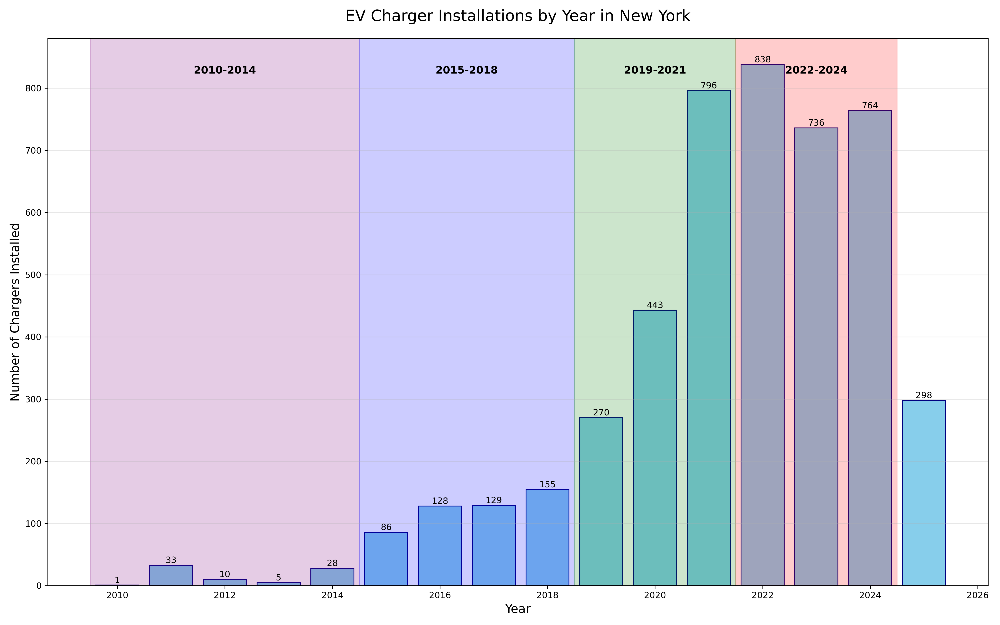
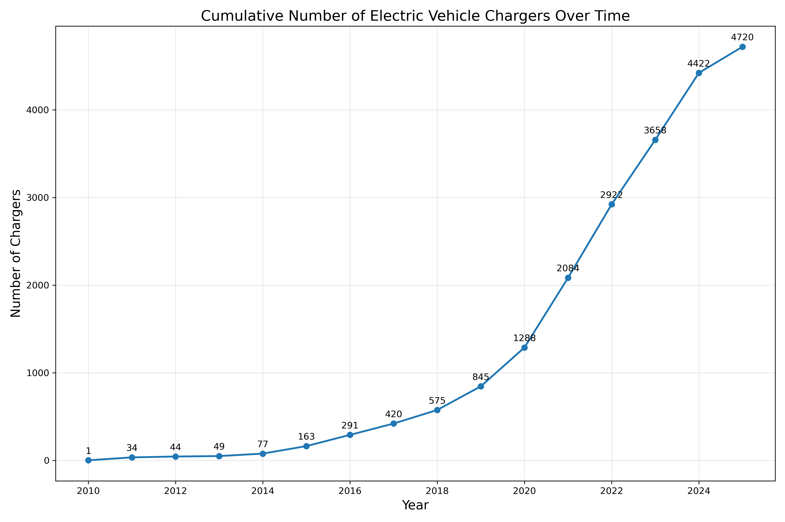
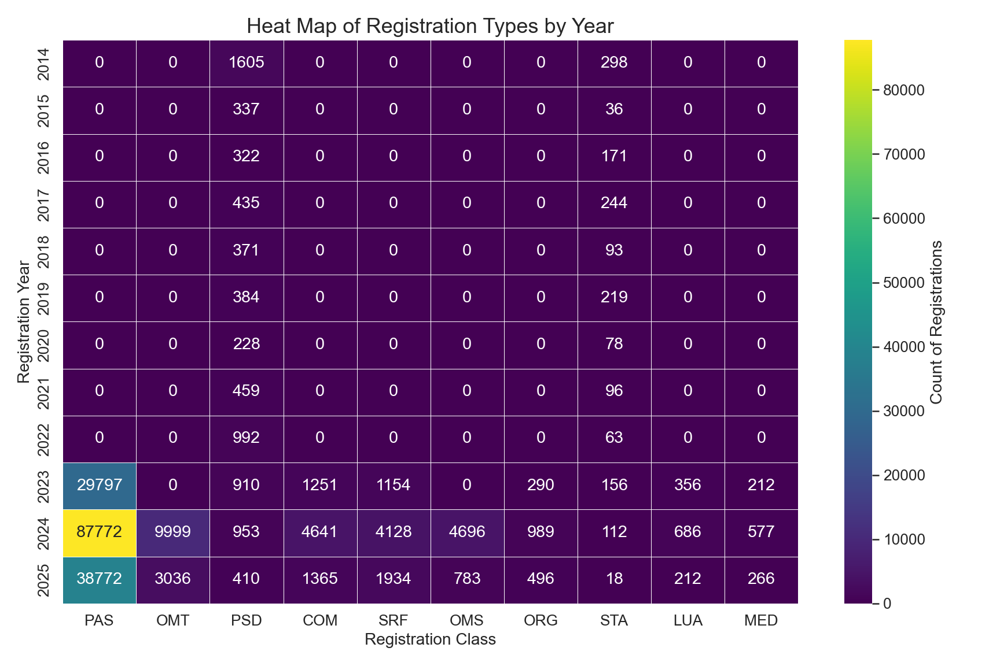
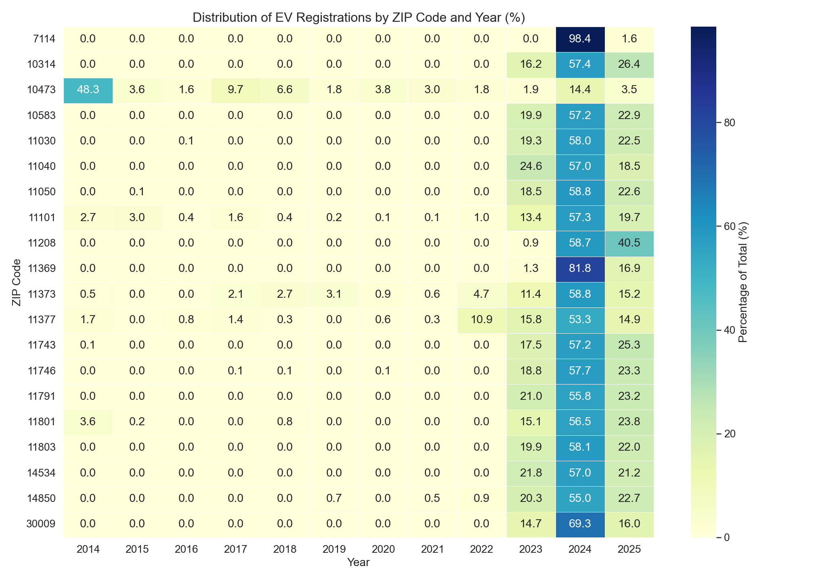
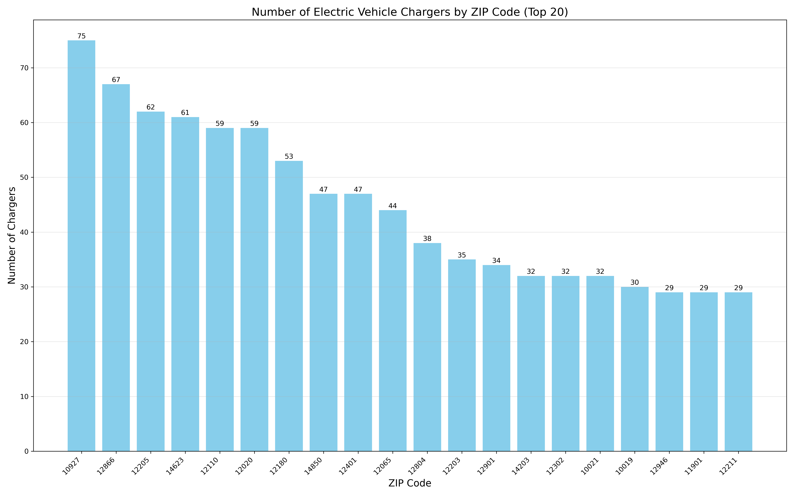
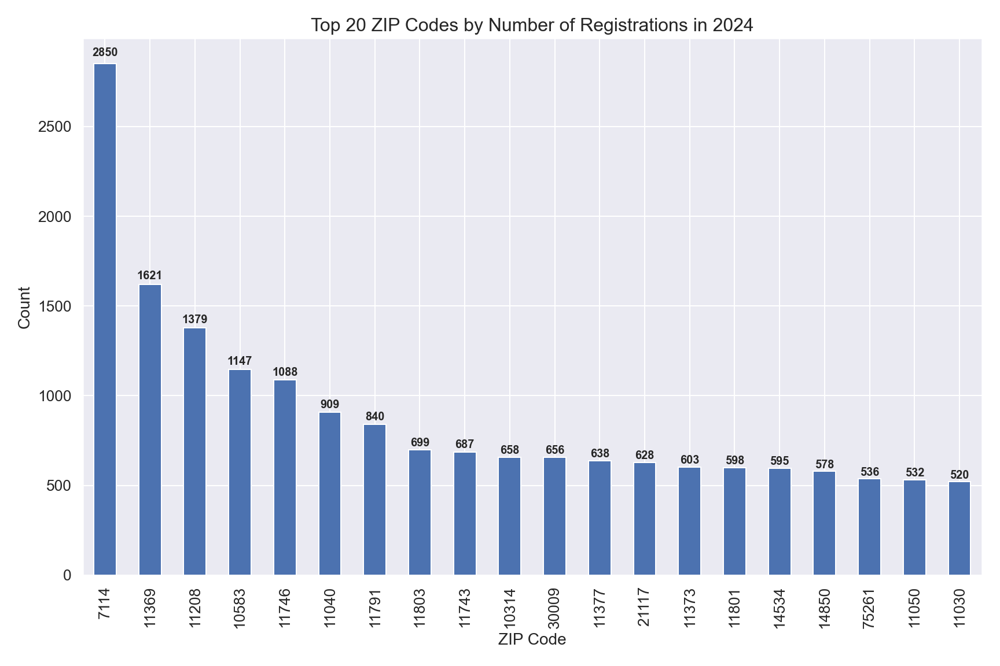

# EVs & Charging Infrastructure in NY

## I. Overview
The rapid adoption of electric vehicles (EVs) presents both opportunities and challenges for transportation electrification in the US. This project investigates the alignment between EV adoption patterns and public charging infrastructure deployment across ZIP codes and counties in New York State. By analyzing vehicle registration records and EV charging station data from 2010 to 2025, the study identifies spatial and temporal mismatches that may hinder equitable access to EV technology and inform strategic infrastructure planning. Particular attention is given to areas where EV registrations have surged recently (2023–2025), revealing potential lag in infrastructure support. Through detailed visualizations and heatmaps, this analysis highlights not only the growth trajectory of EV usage but also critical infrastructure gaps that may affect continued adoption, especially outside of historically prioritized urban cores.

## II. Data Source & Input Data Files

### Raw Data

#### EV Registration Data
* Obtained from NY Open Data Transportation Category
* Data Source: [NY DMV Vehicle Registration Data](https://data.ny.gov/Transportation/Vehicle-Snowmobile-and-Boat-Registrations/w4pv-hbkt/about_data)
* Updated quarterly with vehicle registration information
* Contains vehicle type, fuel type, and registration location by ZIP code
* Analysis focuses on vehicles with record_type = 'VEH' and excludes boats, ATVs, and other non-relevant vehicle types

#### EV Public Charging Station Data
* Obtained from The U.S. Department of Energy's (DOE) Alternative Fuels Data Center (AFDC)
* Data Source: [NYSERDA EV Station Locator](https://www.nyserda.ny.gov/All-Programs/Drive-Clean-Rebate-For-Electric-Cars-Program/Charging-Options/Electric-Vehicle-Station-Locator#/analyze?region=US-NY&show_map=true)
* Provides information on all public charging stations in NY State filtered for 'ELEC' fuel type
* Includes station location, charging type, installation year, and geographical coordinates
* Temporal data shows significant growth in charging infrastructure since 2010

#### Geographic Boundary Data
* Obtained from US Census Bureau's 2024 TIGER/Line Shapefiles
* Data Source: [US Census TIGER/Line Shapefiles](https://www.census.gov/geographies/mapping-files/time-series/geo/tiger-line-file.html)
* Provides detailed geographic boundary data for New York state
* Used for spatial analysis and visualization of charging infrastructure distribution

### Input Data Files
* `Vehicle_Registrations.csv`: Raw DMV vehicle registration data
* `alt_fuel_stations.csv`: Alternative fuel stations data from AFDC
* `ny_tiger_shapfile/tl_2024_36_cousub.shp`: US Census 2024 TIGER/Line Shapefiles for NY state boundaries

## III. Script Descriptions

### Data Processing and Vehicle Registration Analysis
* `clean_ev_data()`: Preprocesses vehicle registration data by:
  * Filtering for vehicle record types ('VEH')
  * Dropping unnecessary columns
  * Standardizing column names
  * Creating registration year from date
  * Removing records before 2000
  * Filtering out non-relevant registration classes and body types
  * Saving cleaned data to `cleaned_EV_reg.csv`

* `analyze_ev_data_basic()`: Generates descriptive statistics and visualizations:
  * Bar charts showing top 20 ZIP codes by registration count in 2024
  * Line graphs showing registration trends for top 5 ZIP codes from 2020-2025
  * All visualizations include count labels for easy interpretation

* `create_heatmap()`: Creates two heatmap visualizations:
  * Registration types by year showing absolute counts
  * Percentage distribution showing changing composition over time
  * Focusses on top 10 registration classes by volume

* `create_zip_heatmap()`: Produces heatmaps of registrations by ZIP code and year:
  * Absolute count heat map for top 20 ZIP codes
  * Normalized percentage distribution showing year-over-year growth patterns

### Charging Station Analysis
* Import and filtering of alternative fuel stations to focus on electric (ELEC) charging stations
* Temporal analysis:
  * Cumulative timeline of EV charger installations over time
  * Annual installation rates with colored year ranges for visual grouping
  * Four distinct period analyses: 2010-2014, 2015-2018, 2019-2021, 2022-2024

* Spatial analysis:
  * Distribution of charging stations by ZIP code (top 20)
  * Density maps showing statewide charger distribution
  * Heat maps visualizing concentration areas
  * NYC-specific focus map showing urban charging infrastructure
  * Multi-panel maps breaking down installations by time period

* Data export:
  * Processed data saved to `data/electric_charging_stations.csv`
  * Summary statistics compiled in `data/summary_statistics.csv`

## IV. Visualizations

### EV Charger Infrastructure Growth and Distribution

1. **Annual EV Charger Installations (2010-2025)**

   
   
   * Dramatic growth in EV charger installations across different time periods in New York State
   * Initial slow adoption (2010-2014) with fewer than 50 chargers annually
   * Moderate growth phase (2015-2018) reaching 155 installations by 2018
   * Rapid acceleration (2019-2021) with peak installation of 796 chargers in 2021
   * Continued strong deployment (2022-2024) with some fluctuation but maintaining over 700 annual installations
   * Recent decline to 298 installations in 2025 (partial year data)

2. **Geographic Distribution of Charger Installations (2010-2024)**

   
   
   * The four-panel map visualization illustrates the spatial evolution of charger deployment:
   * 2010-2014: Limited installations (77 total) clustered primarily in NYC, Buffalo, and Rochester areas
   * 2015-2018: Expanded coverage (498 total) with increased density in NYC metro area and growth along major highway corridors
   * 2019-2021: Substantial proliferation (1,509 total) with widespread coverage across the state, including rural areas
   * 2022-2024: Dense statewide network (2,338 total) with heavy concentration in NYC metro region and coverage extending to most populated areas

3. **Cumulative EV Charger Growth (2010-2025)**

   
   
   * Exponential growth in total charger installations:
   * Slow initial deployment (1-163 chargers) from 2010-2015
   * Accelerating growth (291-1,296 chargers) from 2016-2020
   * Dramatic expansion (2,084-4,720 chargers) from 2021-2025
   * The curve steepens significantly after 2020, indicating rapid infrastructure scaling

4. **Registration Type Trends (2014-2025)**

   
   
   * Significant shift in EV registration classifications:
   * 2014-2022: Dominated by PSD (Political Subdivision) registrations with minor STA (State Owned Vehicle) presence
   * 2023-2025: Major transition to PAS (Passenger) classification (>75% of registrations)
   * Emergence of diverse registration types in later years (Commerical, Speacial Registration Fee, Omnibus Private Rental, Organizations, Limited Use Automobile, Medical)
   * This indicates evolution in the types of EVs being registered and potentially policy/classification changes

5. **ZIP Code Distribution of EV Registrations (2014-2025)**

   
   
   * Temporal pattern of registrations across top ZIP codes:
   * Minimal activity across most ZIP codes from 2014-2022
   * Significant concentration in 2023-2025 period across all ZIP codes
   * Most ZIP codes show highest registration activity in 2024 (>55% of their total registrations)
   * 2025 data showing continued strong adoption (typically 15-25% of total)

6. **Top 20 ZIP Codes by EV Charger Count**

   
   
   * Infrastructure concentration areas:
   * Spring Valley (zip: 10977) leads with 75 public charging stations, followed by Saratoga Springs has 67 chargers (zip: 12866), and Albany has 62 chargers (zip: 12205)
   * Top 20 ZIP codes show relatively even distribution (29-75 chargers per ZIP)
   * These areas represent key hubs in the charging network

7. **Top 20 ZIP Codes by 2024 EV Registrations**

   
   
   * Adoption hotspots:
   * Newark (zip: 7114) dramatically leads with 2,850 registrations
   * Second-tier adoption in East Elmhurst (zip: 11369) with 1,621 EVs and Brooklyn (zip: 11208) with 1,379 EVs
   * Significant drop-off after top 7 ZIP codes (all with >800 registrations)

### Charger-Registration Alignment Analysis

When comparing the EV charger distribution with registration hotspots, several important mismatches become apparent:

* **Major Adoption-Infrastructure Gap**: Newark has the highest EV registrations (2,850) but doesn't appear in the top 20 for charger installations
* **Infrastructure-Rich Areas with Lower Adoption**: Several locations with high public charging counts (Spring Valley, Saratoga Valley, and Albany) don't appear in the top registration areas
* **Geographic Disparities**: The registration data suggests high concentration in certain suburban communities, while charger infrastructure appears more distributed along transportation corridors
* **Temporal Differences**: The registration surge is very recent (2023-2025) while charger installation has been more gradual since 2018, suggesting infrastructure may be playing catch-up

## V. Key Findings

1. **EV Adoption Acceleration**
   * EV registrations have exploded in New York State since 2023, with over 50% of registrations occurring in 2024 alone
   * Registration patterns show extreme concentration in certain ZIP codes, with Newark having nearly twice as many registrations as the second-highest
   * A significant shift from political subdivision to regular passgenger vehicle in 2023 suggests either a policy change in vehicle registration or a fundamental shift in the types of EVs being purchased. EV adoption switched from governmental used vehicle to more widely usage in general population

2. **Charging Infrastructure Evolution**
   * EV charger deployment shows a clear four-phase pattern:
     - Pilot phase (2010-2014): Limited installations averaging under 20 per year
     - Early growth (2015-2018): Moderate expansion averaging ~125 per year
     - Acceleration (2019-2021): Rapid deployment averaging ~500 per year
     - Maturation (2022-2024): Sustained high installation rates averaging ~780 per year
   * Cumulative charger count has grown exponentially, reaching 4,720 by 2025
   * Installation has focused on creating statewide coverage while ensuring concentration in high-traffic areas

3. **Critical Infrastructure-Adoption Misalignment**
   * The analysis reveals substantial geographic mismatches between areas with high EV adoption and those with robust charging infrastructure
   * Top registration areas often have disproportionately fewer chargers relative to their EV population
   * Several areas with extensive charging infrastructure show comparatively lower EV registration rates
   * The rapid acceleration of adoptions in 2023-2024 has outpaced infrastructure development in key communities

4. **Temporal Patterns**
   * Charger installations showed steady growth from 2015-2021 before stabilizing at a higher level
   * EV registrations remained relatively low until 2023, then surged dramatically
   * This timing gap suggests infrastructure development preceded and potentially enabled the subsequent adoption boom

5. **Geographic Concentration**
   * Both charger installations and EV registrations show distinct geographic clustering
   * NYC metropolitan area dominates in both categories, though not always in the same specific ZIP codes
   * Secondary clusters appear around Buffalo, Rochester, Albany, and along the Hudson Valley corridor

## VI. Conclusion and Recommendations

This project highlights the dynamic and uneven growth of electric vehicle adoption and public charging infrastructure in New York State. Key takeaways include the exponential rise in EV registrations, especially in 2023–2024, outpacing infrastructure growth in several high-adoption ZIP codes. While charging infrastructure has expanded significantly since 2015, especially in urban and high-traffic areas, the current network does not consistently align with emerging adoption hotspots, such as Newark and East Elmhurst.

**For Policymakers and Infrastructure Planners:**
* Targeted Infrastructure Deployment: Policymakers should prioritize investment in areas showing rapid EV adoption but limited charging capacity, using predictive models to anticipate future demand.

* Equity-Oriented Planning: ZIP code-level disparities suggest that public charging infrastructure may be underserving lower-income or high-density residential communities. Addressing these gaps is critical to avoid deepening mobility inequities.

* Integrated Planning Timelines: The data reveal a temporal disconnect—charging infrastructure scaled earlier, but EV adoption has surged more recently. Future programs should better coordinate rollout timelines to ensure readiness for market shifts.

This repository provides all code and methodology needed to replicate or extend this analysis as new data becomes available.